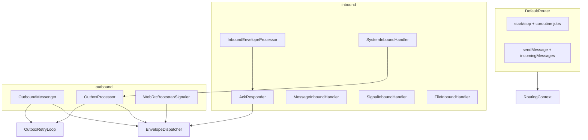

# Router decomposition guide

This document tracks the incremental split of `DefaultRouter` into focused collaborators. The public `Router` API stays unchanged; only internal structure moves.

## Goal

`DefaultRouter` currently mixes lifecycle, transport wiring, outbound send/outbox, inbound pipeline, per-packet handlers, and ACK/NACK replies. The target is a thin orchestrator that composes single-responsibility classes, matching the existing `routing/outbox` and `routing/policy` packages.

## Target package layout

```
routing/
  dispatch/
    EnvelopeDispatcher.kt          ✅ done
  inbound/
    AckResponder.kt                ✅ done
    InboundEnvelopeProcessor.kt    ✅ done
    ProtectionRouting.kt           ✅ done
    handlers/
      MessageInboundHandler.kt     ✅ done
      SignalInboundHandler.kt      ✅ done
      SystemInboundHandler.kt      ✅ done
      FileInboundHandler.kt        ✅ done (stub until Sprint 5)
  outbound/
    OutboundMessenger.kt           (step 6)
    OutboxProcessor.kt             ✅ done
    WebRtcBootstrapSignaler.kt     (step 7)
  router/
    DefaultRouter.kt               (thin orchestrator)
    Router.kt
    RouterConfig.kt
    RoutingContext.kt              ✅ done
    RoutingTypes.kt
  outbox/                          (existing)
  policy/                          (existing)
```

## Architecture



## Completed steps

### Step 1: `RoutingContext` + `EnvelopeDispatcher`

**Files:** `routing/router/RoutingContext.kt`, `routing/dispatch/EnvelopeDispatcher.kt`

`RoutingContext` bundles stable router dependencies and holds `localDeviceIdentity` (set in `DefaultRouter.start()`).

`EnvelopeDispatcher` is the single send path for Tor vs WebRTC:

- `dispatch(envelope, transport)` — used by outbound send, outbox retries, and ACK/NACK
- `hasWebRtcSession(peer)` — shared session lookup for transport policy

### Step 2: `AckResponder`

**File:** `routing/inbound/AckResponder.kt`

Owns inbound reply envelopes:

- `sendAck(...)`
- `sendNack(...)`
- `sendDispositionForDuplicate(...)`

Uses `EnvelopeDispatcher` to send protected `SYSTEM` envelopes. `InboundEnvelopeProcessor` delegates ACK/NACK to `AckResponder`.

### Step 3: Per-type inbound handlers

**Files:** `routing/inbound/handlers/*.kt`, `routing/inbound/InboundEnvelopeHandler.kt`

- `MessageInboundHandler` — decodes/opens messages, emits to `Router.incomingMessages`
- `SignalInboundHandler` — opens WebRTC bootstrap signals
- `SystemInboundHandler` — handles inbound ACK/NACK system payloads via `OutboxProcessor`
- `FileInboundHandler` — stub until Sprint 5

Protection failure mapping lives in `routing/inbound/ProtectionRouting.kt`.

### Step 4: `InboundEnvelopeProcessor`

**File:** `routing/inbound/InboundEnvelopeProcessor.kt`

Owns the inbound pipeline and transport ingress wrappers:

- `handle(envelope, transport)` — dedup → expiry → target check → handler dispatch → ACK/NACK
- `handleTorInbound(...)` — Tor endpoint learning + processing
- `handleWebRtcInbound(...)` — WebRTC envelope processing

### Step 5: `OutboxProcessor`

**File:** `routing/outbound/OutboxProcessor.kt`

Owns outbox retry orchestration and the internal `OutboxRetryLoop`:

- `processDue()` — prune expired, dispatch due entries in parallel, wake loop
- `runIn(scope)` — start the retry loop job (called from `DefaultRouter.start()`)
- `onWebRtcSessionConnected(peerId, sessionId)` — accelerate retries for peer
- `onOutboundPacketDelivered(packetId)` — `markDelivered` + wake (used by `SystemInboundHandler` on ACK/expired NACK)
- `wake()` — notify retry loop (used by `sendMessage` until step 6)

`OutboxRetryLoop` is a private field inside `OutboxProcessor`, wired with `processDue = { processDue() }`. `DefaultRouter` only holds `OutboxProcessor` — no circular init block.

## Remaining migration steps

Do these as small, behavior-preserving PRs. Run existing router tests after each step.

| Step | Extract | From `DefaultRouter` | Test focus |
|------|---------|----------------------|------------|
| 6 | `OutboundMessenger` | `sendMessage`, `sendMessageToPeer` | send message contract tests |
| 7 | `WebRtcBootstrapSignaler` | `handleWebRtcBootstrapSignal` | live WebRTC test (when enabled) |

After step 7, `DefaultRouter` should only:

- implement `Router` lifecycle (`start` / `stop` / `isRunning`)
- wire transport collectors to inbound/outbound collaborators
- expose `incomingMessages` (owned by `MessageInboundHandler` or passed in at construction)

## Class sketches for next steps

### `OutboundMessenger` (step 6)

```kotlin
internal class OutboundMessenger(
    private val ctx: RoutingContext,
    private val dispatcher: EnvelopeDispatcher,
    private val transportPolicy: OutboundPolicy,
    private val outboxProcessor: OutboxProcessor,
) {
    suspend fun sendMessage(account, payload, forceTransport): SendMessageResult
}
```

### `WebRtcBootstrapSignaler` (step 7)

```kotlin
internal class WebRtcBootstrapSignaler(
    private val ctx: RoutingContext,
    private val dispatcher: EnvelopeDispatcher,
) {
    suspend fun signal(signal: WebRtcSignal)
}
```

## What not to split yet

- Outbound protection failure mapping (`handleOutboundProtectionFailure`) — moves with step 6
- `aggregateSendResults` — already in `RoutingTypes.kt`
- Transport collector jobs — can stay in `DefaultRouter` until step 7
- Boot orchestrator (Sprint 3) — `OutboxProcessor.processDue()` becomes the natural hook later

## Sprint alignment

| Sprint | Extension point |
|--------|-----------------|
| 3 Boot recovery | `OutboxProcessor.processDue()` on startup |
| 5 Files | `FileInboundHandler` + outbound file enqueue |
| 6 WebRTC resilience | `WebRtcBootstrapSignaler`, `onWebRtcSessionConnected` |
| 4 Relay / firewall | Tor endpoint update stays in Tor ingress wrapper |

## Testing strategy

Existing tests remain the safety net:

- `DefaultRouterContractTest` — lifecycle, send, inbound ACK/NACK
- `DefaultRouterOutboxTest` — retry and ACK removal
- `DefaultRouterE2eeIntegrationTest` — end-to-end encrypted delivery

After each extraction, add focused unit tests for the new class where practical (e.g. `EnvelopeDispatcher` with recording transports, `AckResponder` with a fake dispatcher).
