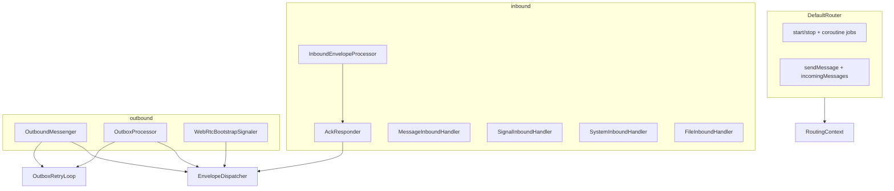

# Router decomposition guide

This document tracks the incremental split of `DefaultRouter` into focused collaborators. The public `Router` API stays unchanged; only internal structure moves.

## Goal

`DefaultRouter` currently mixes lifecycle, transport wiring, outbound send/outbox, inbound pipeline, per-packet handlers, and ACK/NACK replies. The target is a thin orchestrator that composes single-responsibility classes, matching the existing `routing/outbox` and `routing/policy` packages.

## Target package layout

```
routing/
  dispatch/
    EnvelopeDispatcher.kt          ✅ done
  inbound/
    AckResponder.kt                ✅ done
    InboundEnvelopeProcessor.kt    (step 4)
    ProtectionRouting.kt           (optional helpers)
    handlers/
      MessageInboundHandler.kt     (step 3)
      SignalInboundHandler.kt      (step 3)
      SystemInboundHandler.kt      (step 3)
      FileInboundHandler.kt        (step 3, stub until Sprint 5)
  outbound/
    OutboundMessenger.kt           (step 6)
    OutboxProcessor.kt             (step 5)
    WebRtcBootstrapSignaler.kt     (step 7)
  router/
    DefaultRouter.kt               (thin orchestrator)
    Router.kt
    RouterConfig.kt
    RoutingContext.kt              ✅ done
    RoutingTypes.kt
  outbox/                          (existing)
  policy/                          (existing)
```

## Architecture



## Completed steps

### Step 1: `RoutingContext` + `EnvelopeDispatcher`

**Files:** `routing/router/RoutingContext.kt`, `routing/dispatch/EnvelopeDispatcher.kt`

`RoutingContext` bundles stable router dependencies and holds `localDeviceIdentity` (set in `DefaultRouter.start()`).

`EnvelopeDispatcher` is the single send path for Tor vs WebRTC:

- `dispatch(envelope, transport)` — used by outbound send, outbox retries, and ACK/NACK
- `hasWebRtcSession(peer)` — shared session lookup for transport policy

### Step 2: `AckResponder`

**File:** `routing/inbound/AckResponder.kt`

Owns inbound reply envelopes:

- `sendAck(...)`
- `sendNack(...)`
- `sendDispositionForDuplicate(...)`

Uses `EnvelopeDispatcher` to send protected `SYSTEM` envelopes. `DefaultRouter.handleInboundEnvelope` delegates ACK/NACK to `AckResponder`.

## Remaining migration steps

Do these as small, behavior-preserving PRs. Run existing router tests after each step.

| Step | Extract | From `DefaultRouter` | Test focus |
|------|---------|----------------------|------------|
| 3 | Per-type handlers | `handleMessageEnvelope`, `handleSignalEnvelope`, `handleSystemEnvelope`, `handleFileEnvelope` | E2EE integration test |
| 4 | `InboundEnvelopeProcessor` | `handleInboundEnvelope`, Tor/WebRTC ingress wrappers | `DefaultRouterContractTest` inbound cases |
| 5 | `OutboxProcessor` | `processDueOutbox`, `processDueOutboxEntry`, `handleWebRtcSessionState` | `DefaultRouterOutboxTest` |
| 6 | `OutboundMessenger` | `sendMessage`, `sendMessageToPeer` | send message contract tests |
| 7 | `WebRtcBootstrapSignaler` | `handleWebRtcBootstrapSignal` | live WebRTC test (when enabled) |

After step 7, `DefaultRouter` should only:

- implement `Router` lifecycle (`start` / `stop` / `isRunning`)
- wire transport collectors to inbound/outbound collaborators
- expose `incomingMessages` (owned by `MessageInboundHandler` or passed in at construction)

## Class sketches for next steps

### `InboundEnvelopeProcessor` (step 4)

```kotlin
internal class InboundEnvelopeProcessor(
    private val ctx: RoutingContext,
    private val ackResponder: AckResponder,
    private val handlers: Map<PacketType, InboundEnvelopeHandler>,
) {
    suspend fun handle(envelope: BinaryEnvelope, transport: RouterTransport) { ... }
}
```

Pipeline: dedup → expiry → target check → delegate handler → map `InboundHandleResult` to ACK/NACK.

### `OutboxProcessor` (step 5)

```kotlin
internal class OutboxProcessor(
    private val ctx: RoutingContext,
    private val dispatcher: EnvelopeDispatcher,
    private val transportPolicy: OutboundPolicy,
    private val outboxRetryLoop: OutboxRetryLoop,
) {
    suspend fun processDue() { ... }
    fun onWebRtcSessionConnected(peerId: PeerId) { ... }
}
```

Wire via `OutboxRetryLoop(processDue = { outboxProcessor.processDue() })` — same pattern as today.

### `OutboundMessenger` (step 6)

```kotlin
internal class OutboundMessenger(
    private val ctx: RoutingContext,
    private val dispatcher: EnvelopeDispatcher,
    private val transportPolicy: OutboundPolicy,
    private val outboxRetryLoop: OutboxRetryLoop,
) {
    suspend fun sendMessage(account, payload, forceTransport): SendMessageResult
}
```

### Handler interface (step 3)

```kotlin
internal fun interface InboundEnvelopeHandler {
    suspend fun handle(env: BinaryEnvelope): InboundHandleResult
}
```

`MessageInboundHandler` also owns the `MutableSharedFlow<MessagePayload>` for `Router.incomingMessages`.

## What not to split yet

- Protection failure mapping (`inboundResultForProtectionFailure`, `handleOutboundProtectionFailure`) — keep inline or move to `ProtectionRouting.kt` when inbound is extracted
- `aggregateSendResults` — already in `RoutingTypes.kt`
- Transport collector jobs — can stay in `DefaultRouter` until step 7
- Boot orchestrator (Sprint 3) — `OutboxProcessor.processDue()` becomes the natural hook later

## Sprint alignment

| Sprint | Extension point |
|--------|-----------------|
| 3 Boot recovery | `OutboxProcessor.processDue()` on startup |
| 5 Files | `FileInboundHandler` + outbound file enqueue |
| 6 WebRTC resilience | `WebRtcBootstrapSignaler`, `onWebRtcSessionConnected` |
| 4 Relay / firewall | Tor endpoint update stays in Tor ingress wrapper |

## Testing strategy

Existing tests remain the safety net:

- `DefaultRouterContractTest` — lifecycle, send, inbound ACK/NACK
- `DefaultRouterOutboxTest` — retry and ACK removal
- `DefaultRouterE2eeIntegrationTest` — end-to-end encrypted delivery

After each extraction, add focused unit tests for the new class where practical (e.g. `EnvelopeDispatcher` with recording transports, `AckResponder` with a fake dispatcher).
