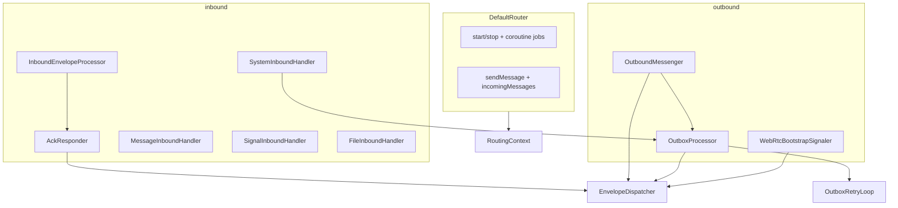

# Router decomposition guide

This document tracks the incremental split of `DefaultRouter` into focused collaborators. The public `Router` API stays unchanged; only internal structure moves.

## Goal

`DefaultRouter` is now a thin orchestrator that composes single-responsibility classes, matching the existing `routing/outbox` and `routing/policy` packages.

## Target package layout

```
routing/
  dispatch/
    EnvelopeDispatcher.kt          ✅ done
  inbound/
    AckResponder.kt                ✅ done
    InboundEnvelopeProcessor.kt    ✅ done
    InboundEnvelopeHandler.kt      ✅ done (interface + inbound protection helpers)
    handlers/
      MessageInboundHandler.kt     ✅ done
      SignalInboundHandler.kt      ✅ done
      SystemInboundHandler.kt      ✅ done
      FileInboundHandler.kt        ✅ done (stub until Sprint 5)
  outbound/
    OutboundMessenger.kt           ✅ done
    OutboxProcessor.kt             ✅ done
    OutboxRetryLoop.kt             ✅ done
    ProtectionRouting.kt           ✅ done
    WebRtcBootstrapSignaler.kt     ✅ done
  router/
    DefaultRouter.kt               ✅ thin orchestrator
    Router.kt
    RouterConfig.kt
    RoutingContext.kt              ✅ done
    RoutingTypes.kt
  policy/                          (existing)
```

## Architecture



## Completed steps

### Step 1: `RoutingContext` + `EnvelopeDispatcher`

**Files:** `routing/router/RoutingContext.kt`, `routing/dispatch/EnvelopeDispatcher.kt`

`RoutingContext` bundles stable router dependencies and holds `localDeviceIdentity` (set in `DefaultRouter.start()`).

`EnvelopeDispatcher` is the single send path for Tor vs WebRTC:

- `dispatch(envelope, transport)` — used by outbound send, outbox retries, ACK/NACK, and WebRTC bootstrap signaling
- `hasWebRtcSession(peer)` — shared session lookup for transport policy

### Step 2: `AckResponder`

**File:** `routing/inbound/AckResponder.kt`

Owns inbound reply envelopes:

- `sendAck(...)`
- `sendNack(...)`
- `sendDispositionForDuplicate(...)`

Uses `EnvelopeDispatcher` to send protected `SYSTEM` envelopes. `InboundEnvelopeProcessor` delegates ACK/NACK to `AckResponder`.

### Step 3: Per-type inbound handlers

**Files:** `routing/inbound/handlers/*.kt`, `routing/inbound/InboundEnvelopeHandler.kt`

- `MessageInboundHandler` — decodes/opens messages, emits to `Router.incomingMessages`
- `SignalInboundHandler` — opens WebRTC bootstrap signals
- `SystemInboundHandler` — handles inbound ACK/NACK system payloads via `OutboxProcessor`
- `FileInboundHandler` — stub until Sprint 5

Inbound protection failure mapping lives in `routing/inbound/InboundEnvelopeHandler.kt`.

### Step 4: `InboundEnvelopeProcessor`

**File:** `routing/inbound/InboundEnvelopeProcessor.kt`

Owns the inbound pipeline and transport ingress wrappers:

- `handle(envelope, transport)` — dedup → expiry → target check → handler dispatch → ACK/NACK
- `handleTorInbound(...)` — Tor endpoint learning + processing
- `handleWebRtcInbound(...)` — WebRTC envelope processing

### Step 5: `OutboxProcessor`

**File:** `routing/outbound/OutboxProcessor.kt`

Owns outbox retry orchestration and the internal `OutboxRetryLoop`:

- `processDue()` — prune expired, dispatch due entries in parallel, wake loop
- `runIn(scope)` — start the retry loop job (called from `DefaultRouter.start()`)
- `onWebRtcSessionConnected(peerId, sessionId)` — accelerate retries for peer
- `onOutboundPacketDelivered(packetId)` — `markDelivered` + wake (used by `SystemInboundHandler` on ACK/expired NACK)
- `wake()` — notify retry loop

`OutboxRetryLoop` is a private field inside `OutboxProcessor`, wired with `processDue = { processDue() }`.

### Step 6: `OutboundMessenger`

**File:** `routing/outbound/OutboundMessenger.kt`

Owns outbound message send:

- `sendMessage(account, payload, forceTransport)` — peer fan-out, protection, outbox enqueue, immediate dispatch
- Outbound protection failure mapping in `routing/outbound/ProtectionRouting.kt`

`DefaultRouter.sendMessage` delegates here after the started check.

### Step 7: `WebRtcBootstrapSignaler`

**File:** `routing/outbound/WebRtcBootstrapSignaler.kt`

Owns outbound WebRTC bootstrap signaling over Tor:

- `signal(signal)` — protect signal envelope, dispatch via `EnvelopeDispatcher` on `RouterTransport.TOR`

Wired from `webRtcTransport.outgoingBootstrapSignals` collector in `DefaultRouter.start()`.

## `DefaultRouter` responsibilities (final)

- implement `Router` lifecycle (`start` / `stop` / `isRunning`)
- wire transport collectors to inbound/outbound collaborators
- expose `incomingMessages` (owned by `MessageInboundHandler`)
- delegate `sendMessage` to `OutboundMessenger`

## Sprint alignment

| Sprint | Extension point |
|--------|-----------------|
| 3 Boot recovery | `OutboxProcessor.processDue()` on startup |
| 5 Files | `FileInboundHandler` + outbound file enqueue via `OutboundMessenger` |
| 6 WebRTC resilience | `WebRtcBootstrapSignaler`, `OutboxProcessor.onWebRtcSessionConnected` |
| 4 Relay / firewall | Tor endpoint update stays in Tor ingress wrapper |

## Testing strategy

Existing tests remain the safety net:

- `DefaultRouterContractTest` — lifecycle, send, inbound ACK/NACK
- `DefaultRouterOutboxTest` — retry and ACK removal
- `DefaultRouterE2eeIntegrationTest` — end-to-end encrypted delivery
- `DefaultRouterLiveIntegrationTest` — live WebRTC (when enabled)

Focused unit tests for extracted classes can be added where practical (e.g. `EnvelopeDispatcher` with recording transports, `AckResponder` with a fake dispatcher).
